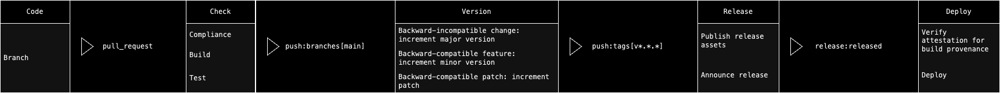

# :fontawesome-solid-flask-vial: Introduction

!!! quote ":octicons-milestone-16: Workshop Exercises"

    Continuous deployment by itself is a large value stream; depending on the complexity of an organization's needs, the implementation may likely turn out to be complex to the extent that it may overwhelm maintainers. Using bounded contexts, we borrow strategy from Domain-Driven Design to simplify our implementation.

    So, what are some of the values we expect from an effective implementation of continuous deployment?

    - **Fully automated deployment cycles**. This enables organizations to spend more time building software instead of pausing development work in preparation for “release day.”
    - **More regular, incremental deployments**. This leads to faster product development work and helps facilitate a continuous improvement model.
    - **Fast feedback loops on new features**. Organizations can quickly get real-time feedback on new features, updates, and code changes.

    With these values in mind, we can identify bounded contexts and design a meaningful integration among them.

    

    Before diving into the exercises proper, take a moment to explore the existing workflows in the repository. We can discuss your first impressions and any questions you have.
