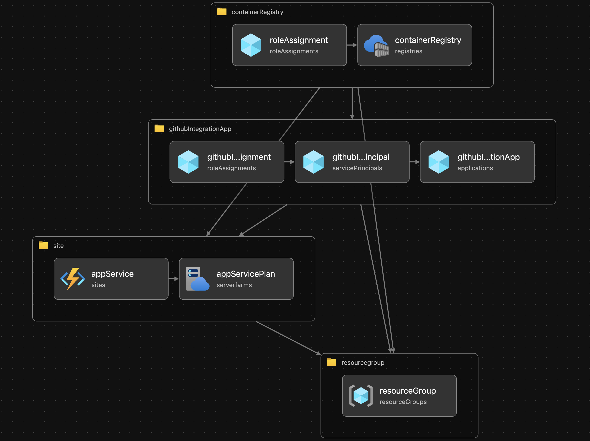

# :footprints: Prerequisites

<!-- markdownlint-disable MD033 -->

The following list of **`Day 0`** operations are the prerequisites for the live workshop session, and should be completed in order.

<div class="grid cards" markdown>
-   ## :material-numeric-1-circle: **Set up a cloud services account**

    !!! info "GitHub Universe 2024 session provision"

        Participants at the live session will be provided with Azure subscriptions and details will be shared at the beginning of the workshop.

    In the workshop, we will deploy an application to a cloud provider. GitHub generally supports secure integration with most cloud providers; at this point of preparation for the work, we will ensure we have a properly setup cloud provider account.

    === ":material-microsoft-azure: Microsoft Azure"

        Although you may use your existing Azure `subscription`, we do recommend you create a completely new account (and subscription) for this workshop and leverage the `$200` Azure credit on offer for your new subscriptions.

        !!! note "Take note of your subscription id"

            We will use the `subscription id` to provision the infrastructure resources to be deployed to. [**Find your Azure subscription**](https://learn.microsoft.com/en-us/azure/azure-portal/get-subscription-tenant-id#find-your-azure-subscription){target="\_blank"}.

        [:material-cursor-default-click: Create a free Azure account](https://azure.microsoft.com/free/){.md-button target="\_blank"}

    === ":material-aws: Amazon Web Services"

        :material-cloud-off: This aspect of the workshop is currently not supported, but you can help contribute the guide. Would you like to help the community learn to secure their deployments to AWS?

    === ":material-google-cloud: Google Cloud Platform"

        :material-cloud-off: This aspect of the workshop is currently not supported, but you can help contribute the guide. Would you like to help the community learn to secure their deployments to GCP?

</div>

---

<div class="grid cards" markdown>
-   ## :material-numeric-2-circle: **Set up a GitHub account**

    !!! info "GitHub Universe 2024 session provision"

        Participants at the live session will be provided with a GitHub Enterprise Managed User account (including [GitHub Copilot](https://github.com/features/copilot){target="\_blank"} and [GitHub Advanced Security](https://github.com/enterprise/advanced-security){target="\_blank"} features). Account details will be shared at the beginning of the workshop the session.

        Learn more about "[About Enterprise Managed Users](https://docs.github.com/en/enterprise-cloud@latest/admin/managing-iam/understanding-iam-for-enterprises/about-enterprise-managed-users){target="\_blank"}".

    Login to your GitHub account. You may create a new GitHub account, if you do not already have one. (1)
    { .annotate }

    1. :bulb: Clicking the button below will open the page on a new tab, for you to create a new GitHub account. Keep your **`@handle`** handy after you have logged in.

    [:material-cursor-default-click: Create a new GitHub account](https://github.com/signup){.md-button target="\_blank"}

</div>

---

<div class="grid cards" markdown>
-   ## :material-numeric-3-circle: **Use the workshop template to create a new repository**

    Clicking the button below will lead you to create the workshop project in a new browser tab. The repository creation form should already be correctly pre-filled you. After proofing the form, scroll down to the bottom of the page and click the <span class="gh-button-green">Create repository</span> button to create the repository.

    !!! note ""

          - Ensure the {== **`demos-by-igwejk`** ==} organization is selected as owner
          - Since we are sharing the organization, please prefix the repository name with your assigned username
          - {== This point is **not** relevant for the live session. ==} Individuals who are _**not**_ a member of an enterprise may choose a `public` repository visibility to take advantage of significantly many of GitHub platform's features at no cost. (1)
            { .annotate }

            1. :bulb: GitHub supports open-source software development by making public repositories benefit from

                - [Free use of GitHub Actions minutes](https://docs.github.com/en/billing/managing-billing-for-github-actions/about-billing-for-github-actions){target="\_blank"}.
                - [Free use of GitHub Advanced Security features](https://docs.github.com/en/get-started/learning-about-github/about-github-advanced-security#about-advanced-security-features){target="\_blank"}.

    [:material-cursor-default-click: Create workshop project](https://github.com/new?template_owner=demos-by-igwejk&template_name=continuous-deployments-the-github-way&owner=%40me&name=continuous-deployments-the-github-way-workshop&description=Continuous+deployments,+the+GitHub+way&visibility=public){.md-button target="\_blank"}

</div>

---

<div class="grid cards" markdown>
-   ## :material-numeric-4-circle: **Create a cloud development environment instance**

    GitHub Codespaces enable you to instantly create a productive development environment and start coding on the workshop project. Personal accounts on GitHub can benefit from a [free quota of GitHub Codespaces usage](https://docs.github.com/en/billing/managing-billing-for-github-codespaces/about-billing-for-github-codespaces#monthly-included-storage-and-core-hours-for-personal-accounts){target="\_blank"}.

    To begin, go to your newly created repository

    1. Navigate to the :octicons-code-16: **Code** tab.
    2. Open the <span class="gh-button-green">:octicons-code-16: Code :material-menu-down:</span> menu and click on <span class="gh-button-green">Create codespace on main</span>.

</div>

---

<div class="grid cards" markdown>
-   ## :material-numeric-5-circle: **Provision cloud service infrastructure**

    We will take advantage of managed services to provide a framework for resiliently deploying and running our application.

    === ":material-microsoft-azure: Microsoft Azure"

        [Azure App Service](https://learn.microsoft.com/en-us/azure/app-service/){target="\_blank"} provides a framework for developing and running apps in the cloud. PaaS providers host and maintain the platform's servers, networks, storage, and other computing resources. Developers use the platform to build apps without having to manage backups, security solutions, upgrades, or other administrative tasks. App Service also includes tools, services, and systems that support the web application lifecycle.

        {==

        The **`infrastructure/day-0/provision.azcli`** script is designed to provision the required cloud resources on Microsoft Azure.

        ==}

        ```bash title="infrastructure/day-0/provision.azcli" linenums="1" hl_lines="8 10-11 13 15 17-21"
        --8<-- "https://raw.githubusercontent.com/demos-by-igwejk/continuous-deployments-the-github-way/refs/heads/main/infrastructure/day-0/provision.azcli"
        ```

        - **Line `8`**

            Securely creates an Azure login session and prompts you to select the subscription on which the script will act on.

        - **Lines `10 - 11`**

            - `infrastructure/day-0/main.bicep` contains the infrastructure deployment template.
              
            - Whereas `infrastructure/day-0/parameters.json` contain the values for variables that are referenced in the template.

            ```json linenums="1"
            --8<-- "https://raw.githubusercontent.com/demos-by-igwejk/continuous-deployments-the-github-way/refs/heads/main/infrastructure/day-0/parameters.json"
            ```

        - **Line `13`**

            Reads the Azure region in which resources will be provisioned are read from the `infrastructure/day-0/parameters.json` file.

        - **Line `15`**

            Designates the outcome of the deployment to be written to `infrastructure/day-0/deployment-outputs.json`.


        !!! example ":octicons-terminal-16: Execute the script on a terminal in your Codespace"

            ```bash
            ./infrastructure/day-0/provision.azcli
            ```

    === ":material-aws: Amazon Web Services"

        :material-cloud-off: This aspect of the workshop is currently not supported, but you can help contribute the guide. Would you like to help the community learn to secure their deployments to AWS?

    === ":material-google-cloud: Google Cloud Platform"

        :material-cloud-off: This aspect of the workshop is currently not supported, but you can help contribute the guide. Would you like to help the community learn to secure their deployments to GCP?

</div>

---

<div class="grid cards" markdown>
-   ## :material-numeric-6-circle: **Get familiar with GitHub Apps**

    [**GitHub Apps**](https://docs.github.com/en/enterprise-cloud@latest/apps/overview){target="\_blank"} are tools that extend GitHub's functionality. GitHub Apps can do things on GitHub like open issues, comment on pull requests, and manage projects. They can also do things outside of GitHub based on events that happen on GitHub. For example, a GitHub App can post on Slack when an issue is opened on GitHub.

    {==

    During the course of the workshop exercises, you will discover how a GitHub App can be used to perform automatic versioning or creation of releases, such that the performed action effectively raises an event that triggers other workflows.

    !!! info "GitHub Universe 2024 session provision"

        A GitHub App will be created for your use, and setup to enable you easily access its [`private key`](https://docs.github.com/en/enterprise-cloud@latest/apps/creating-github-apps/authenticating-with-a-github-app/managing-private-keys-for-github-apps#about-private-keys-for-github-apps){target="\_blank"} and `id` from within the repository you will create for doing the workshop exercises.

    ==}

    ??? question "🧐 What is the use of a GitHub App in this workshop?"

        Using the `GITHUB_TOKEN` that is available to workflows by default for authorization, it is possible to interact with the GitHub platform via API calls. However, there is a caveat...

        > _When you use the repository's `GITHUB_TOKEN` to perform tasks, events triggered by the `GITHUB_TOKEN`, with the exception of `workflow_dispatch` and `repository_dispatch`, will not create a new workflow run. This prevents you from accidentally creating recursive workflow runs. For example, if a workflow run pushes code using the repository's `GITHUB_TOKEN`, a new workflow will not run even when the repository contains a workflow configured to run when push events occur._
        >
        > _If you do want to trigger a workflow from within a workflow run, you can use a GitHub App installation access token or a personal access token instead of `GITHUB_TOKEN` to trigger events that require a token._
        >
        > _If you use a GitHub App, you'll need to create a GitHub App and store the app ID and private key as secrets._
        >
        > ~ [**Triggering a workflow from a workflow**](https://docs.github.com/en/actions/using-workflows/triggering-a-workflow#triggering-a-workflow-from-a-workflow){target="\_blank"}

</div>
